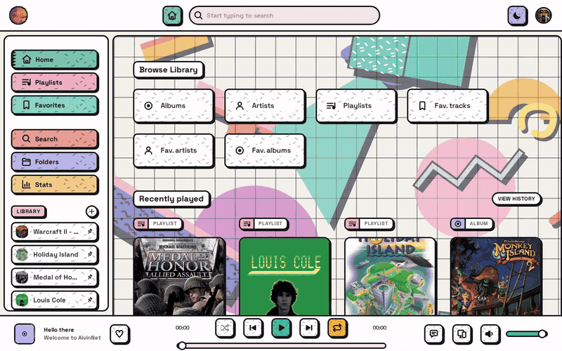
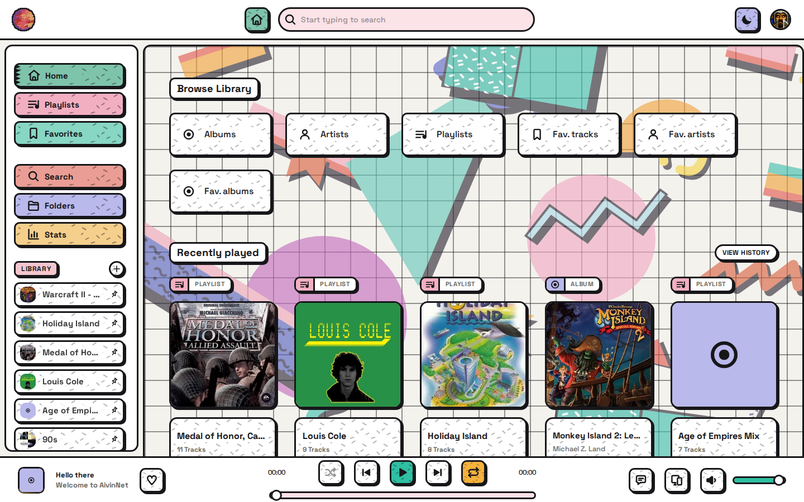
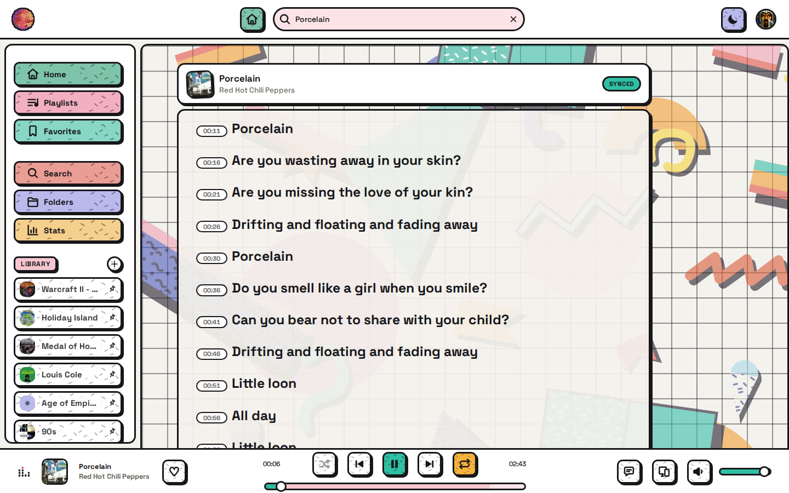
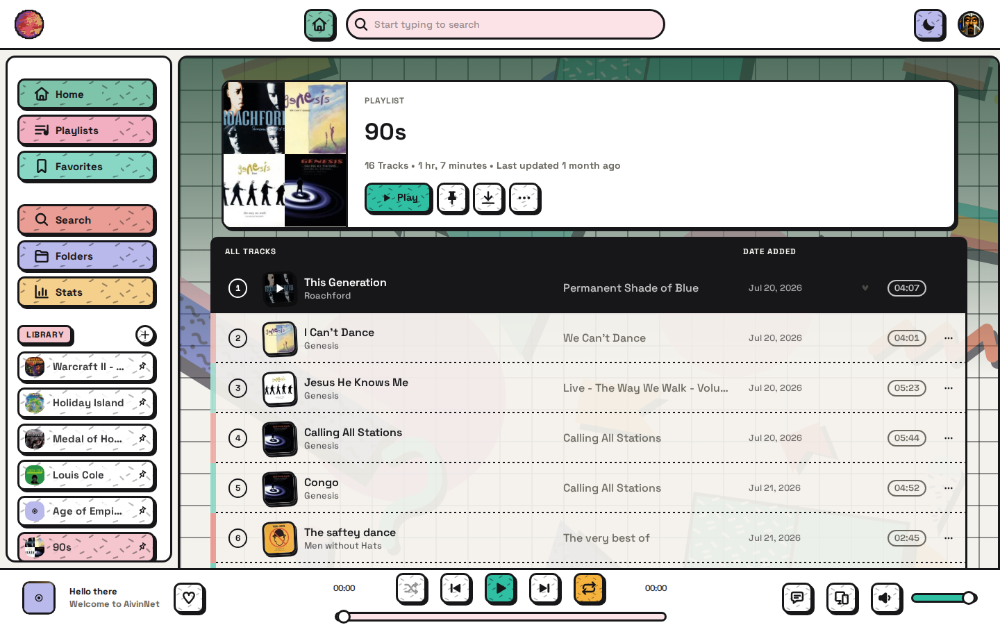
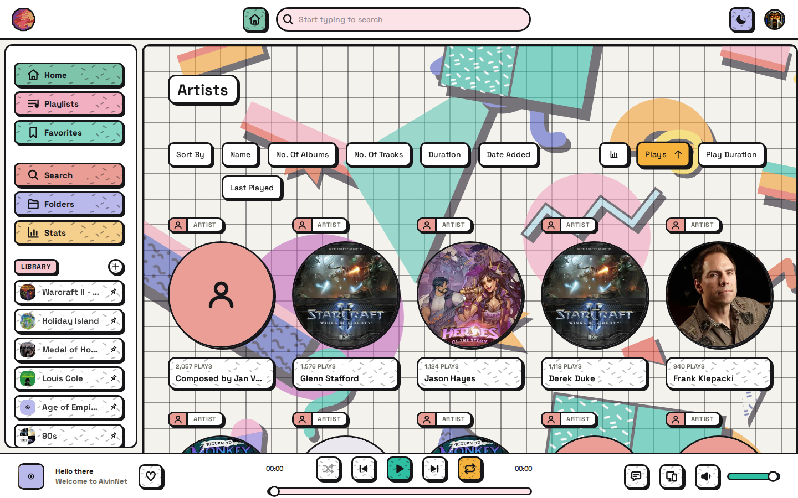
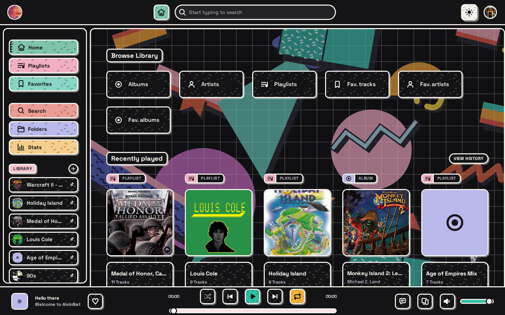
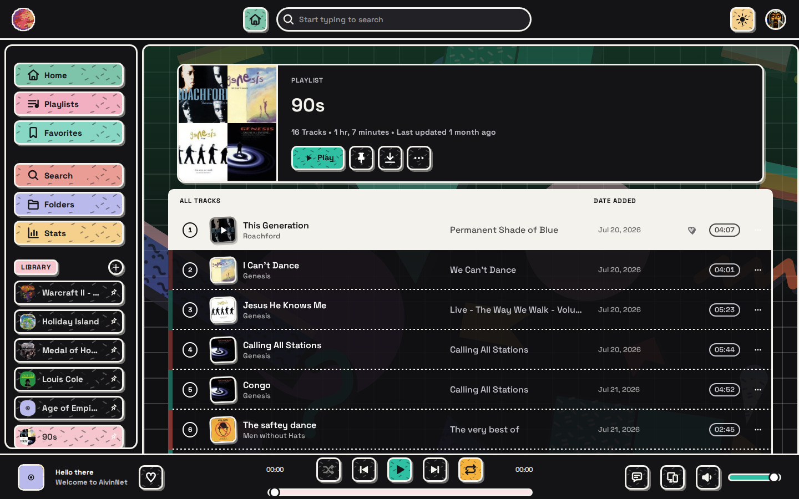

# AivinNet

**Self-hosted music server with a web player of its own**

AivinNet streams your own audio library to a web player with a look of its own —
bold 80s/Memphis shapes and colours, in light and dark. Point it at a folder of
music, open it in a browser, and that is the whole idea. It is a Python/Flask
backend serving a REST API, and a Vue web client — both in this repository.



## What it looks like

|                                                                 |                                                                       |
| --------------------------------------------------------------- | --------------------------------------------------------------------- |
| **Home** — browse your library                                  | **Lyrics** — synced, with a per-line progress bar                     |
|                        |                   |
| **Playlist** — track list with ambient gradient                 | **Artists** — library grid                                            |
|           |                        |

The whole palette flips through the moon toggle in the top bar, and with **Auto
dark mode** on it switches itself: dark from 20:00, light from 08:00.

|                                                                 |                                                                       |
| --------------------------------------------------------------- | --------------------------------------------------------------------- |
| **Home**                                                        | **Playlist**                                                          |
|     |   |

---
---

## What it does

**Your library, browsable.** Point it at one or more folders and it reads the
tags into albums, artists, and tracks. Artist pages split the discography by
type and collect every appearance, guest spots included. Alongside that, a folder
browser walks the directory tree as it sits on disk, for the times the tags are
not the truth. Search covers tracks, albums, and artists, with an A–Z band for
browsing rather than typing. Adding music later means one **Scan for new music**
from the profile menu — AivinNet does not watch the filesystem.

**Playlists and favourites.** Playlists take a cover (uploaded or found online),
can be pinned to the sidebar, and can be filed into folders once there are too
many to scan. Favourites are their own section — tracks, albums, and artists
each with a page.

**Playback.** Gapless, with optional silence-padding removal and an optional
crossfade whose length you set yourself — outside Chromium it carries an
"experimental" badge. A queue you can rearrange by dragging, shuffle and repeat,
and a now-playing screen that is the queue itself, with the lyrics one click away.

**Lyrics.** Synced lyrics from `.lrc` files next to the track or from embedded
tags, with a per-line progress bar. The lyrics plugin can download missing ones,
optionally overriding unsynced text it finds.

**Multiroom.** Pair a second device by scanning a QR code, and playback follows
the group — start on the desktop, pick it up on the phone.

**Editing.** Fix tags in the app, and give an album a cover: upload one, search
online, or write the picture back into the files themselves.

**Downloads.** Pull a whole album or playlist as a ZIP, or as separate files
named from their tags.

**Stats.** What you played, when, and how often — top artists, albums, and
tracks over a week, a month, a year, or all time.

**Accounts.** Multiple users with their own playlists, favourites, and history,
plus an optional shared guest login, so a visitor can listen without an account
of their own. Last.fm scrobbling is per user, with your own API key if you
have one.

**Backup and restore.** One button writes the whole instance — users, playlists,
favourites, play history, and artwork — to `~/aivinnet.backup`, and restores it
on the same machine or another one.

**Elsewhere.** The web client installs as a PWA. There is a REST API behind
everything the client does, and an [MCP server](mcp_server/) so an assistant can
manage playlists and fix tags for you.

**What it does not do:** transcode. Files are streamed as they are — see
[Audio formats](#audio-formats).

---

## Install (Linux)

```sh
curl -fsSL https://raw.githubusercontent.com/vwellenberg/AivinNet/master/install.sh | bash
```

That downloads the release AppImage for your architecture (x86_64 or aarch64),
verifies its checksum, installs it to `~/.local/bin/aivinnet`, and sets up a
systemd service that comes back after a reboot. It prints the URL and the
generated admin password when it is done.

Requirements: a glibc Linux with systemd. **No** Python, compiler, FUSE or
Docker needed — the AppImage is unpacked at install time, so `libfuse2` never
comes up.

### Options

```sh
curl -fsSL .../install.sh | bash -s -- --system --music /mnt/nas/music
```

| Option | Effect |
| --- | --- |
| `--system` | System-wide service (uses `sudo` for the unit file only). Starts before anyone logs in — pick this for an always-on server. |
| `--port <n>` | HTTP port, default `1970`. |
| `--host <addr>` | Bind address, default `0.0.0.0`. |
| `--music <path>` | Pre-selects the library folder **and** makes the service wait for that mount. |
| `--no-autostart` | Install the program without a service. |
| `--version <tag>` | Install a specific release instead of the latest. |
| `--update` | Same as re-running it: fetch the newest release, keep your data. |
| `--uninstall` | Remove service + program files, keep the library data. |

Default is a **user service** (`systemctl --user`, no root) with lingering
enabled so it survives logout and starts at boot. If lingering cannot be enabled
automatically, the installer tells you the one command to run.

> [!IMPORTANT]
> **`--music` matters if your library is on a NAS or external disk.** Without it,
> the service can start before that mount is ready; the library scan then finds
> no files and removes the missing tracks from the database, which leaves your
> playlists full of orphaned entries. `--music` adds `RequiresMountsFor=` to the
> unit so systemd waits.

### After installing

1. Open the printed URL, log in as `admin` with the generated password.
2. Pick your music folder (skipped if you passed `--music`).
3. Wait for the first scan — minutes to an hour, depending on library size.

Everything lives in `~/.config/aivinnet/` (database, covers, playlists) — that
directory is the only copy of your data, so back it up. Service configuration
(port, host) is `~/.config/aivinnet/aivinnet.env`; edit it and restart the
service.

> The directory was called `~/.config/swingmusic/` before v2026.8.0 and is moved
> automatically on first start of a newer version. If yours still carries the old
> name, that is the one to back up.

⚠️ The database is **three** files — `aivinnet.db` plus the `-wal` and `-shm`
sidecars SQLite keeps beside it in WAL mode. Copy them as a set, or the copy is
missing the most recent transactions.

### Other install paths

- **Single-file binaries** for Linux, Windows and macOS are attached to each
  [release](https://github.com/vwellenberg/AivinNet/releases). They are unsigned,
  so SmartScreen/Gatekeeper will warn.
- **Wheel** (`pip`/`uv`): needs Python 3.11+, and on Linux a compiler plus
  `libev-dev` for `bjoern`.
- **Docker**: `ghcr.io/vwellenberg/aivinnet` — [docs/docker.md](docs/docker.md).

None of these has an installer to hand you a password, so the server generates
one on its first start and prints it once — watch that first log. Set
`AIVINNET_ADMIN_PASSWORD` beforehand to choose it yourself, or run
`aivinnet --password-reset` if you miss it.

## Audio formats

Scanned and indexed: **MP3, FLAC, M4A/ALAC, OGG, Opus, WAV, AIFF, WMA**.

⚠️ **Files are streamed as they are — there is no transcoding.** What actually
plays is therefore whatever your *browser* decodes. MP3, FLAC, M4A/AAC, OGG,
Opus and WAV are safe in any current browser; **ALAC and WMA usually are not**,
and a library full of those will be indexed and then refuse to play.

`ffmpeg` is still worth installing: the optional silence-padding removal
decodes tracks with it to find where the silence ends. Without it that feature
quietly does nothing for anything but WAV; playback itself is unaffected.

## Reaching it from outside your LAN

**Do not port-forward this to the internet** — it listens without TLS. Use a
VPN; [docs/remote-access.md](docs/remote-access.md) walks through Tailscale,
which needs no open ports and works behind CGNAT.

## Privacy

**Out of the box, nothing about your library leaves the machine.** Three things
can talk to the internet — artist images and similar artists during a scan,
lyrics lookup, and Last.fm scrobbling — and each is off until you switch it on.
What goes where: [docs/privacy.md](docs/privacy.md).

## Tech Stack

| Layer | Technology |
|---|---|
| Language | Python 3.11+ |
| Web Framework | Flask |
| ORM / Database | SQLAlchemy (SQLite) |
| WSGI server | bjoern (Linux), waitress (Windows) |
| Audio Processing | FFmpeg |

---

## Development

See [CLAUDE.md](CLAUDE.md) for the working agreements (branch workflow, test
lanes, known gotchas).

```sh
uv sync                       # dependencies
uvx ruff check src/ tests/    # lint
```

The web client lives in `client/` — Vue 3 and Vite, with its own `yarn` scripts:

```sh
cd client
yarn install
yarn dev          # dev server
yarn test         # vitest
yarn typecheck    # vue-tsc
```

It used to be its own repository
([vwellenberg/AivinNet-Client](https://github.com/vwellenberg/AivinNet-Client),
now archived); its history came along with it, so `git blame` still reaches
back.

### Releasing

The `Release` workflow (`.github/workflows/build.yml`) is triggered manually. It
builds the client from `client/`, produces wheels, AppImages (x86_64 +
aarch64), single-file binaries and `SHA256SUMS`, and attaches everything to a
GitHub release. Edit `.github/changelog.md` first — it becomes the release body.

---

## Origin and attribution

AivinNet began as a fork of [swingmx/swingmusic](https://github.com/swingmx/swingmusic)
by Mungai Njoroge, and inherits its AGPL-3.0 licence — see below.

It has been developed independently since **June 2025**: the web client was
redesigned from the ground up, and multiroom playback, track editing, playlist
folders, the lyrics finder and the installer were built here. Upstream changes
are no longer merged. The web client fork carries its own MIT licence and
attribution.

---

## License

[GNU AGPL-3.0](LICENSE), inherited from Swing Music. In short: you may use,
modify and share it, but if you distribute it — including running a modified
version as a network service for others — the source has to stay available under
the same licence.
